#CG2111A Alex Rescue Robot

A tele-operated robotic vehicle designed for search-and-rescue operations in a simulated lunar environment. Features LIDAR-based navigation, dual rescue mechanisms (robotic claw and medpack dispenser), and real-time color-based astronaut identification.

## 📋 Mission Overview

**Scenario:** An explosion at Moonbase CEG has left astronauts stranded across the facility. Operating under time pressure and resource constraints, our robot must navigate complex terrain, locate astronauts, and provide appropriate assistance based on their needs.

**Capabilities:**
- 🗺️ Real-time SLAM mapping using LIDAR
- 🎨 Color-based astronaut identification (Red/Green)
- 🦾 Robotic claw for physical relocation
- 💊 Precision medpack delivery system
- 🎮 Tele-operated control with multiple speed modes

**Team:** B04-3B  
**Course:** CG2111A - Engineering Principles and Practice II  
**Semester:** 2, 2024/2025

---

## 🎯 Project Objectives

### Mission Critical Requirements
1. Navigate through maze-like lunar facility terrain
2. Identify astronauts by color (Red = needs evacuation, Green = needs medical supplies)
3. Execute appropriate rescue action:
   - **Red astronaut:** Use claw to drag to safe zone
   - **Green astronaut:** Deploy medpack from rear dispenser
4. Complete mission within time constraints

### Technical Challenges
- Limited wireless communication in disaster environment
- Fabrication constraints (hand-built mechanisms)
- No camera usage allowed (LIDAR-only navigation)
- Real-time operator decision-making under pressure
- Color detection under varying lighting conditions

---

## 🏗️ System Architecture


---

## 🔧 Hardware Design

### System Layout

**Two-Layer Architecture:**

#### Layer 1 (Bottom)
- 4× Hobby motors with wheel encoders
- 2× 4-AA battery holders (8 AA batteries for motor power)
- Cable management and wire reinforcement (masking tape)

#### Layer 2 (Top)
- Arduino ATmega2560 microcontroller
- Motor shield with encoder connections
- Breadboard for circuitry
- **Front:** Robotic claw mechanism with TCS3200 color sensor
- **Rear:** Medpack dispenser compartment
- **Center:** LIDAR scanner (360° unobstructed view)
- Raspberry Pi 4 + power bank (easy access)

### Key Hardware Components

#### 1. Robotic Claw Mechanism 🦾

**Design Philosophy:** Lightweight, simple, repairable

**Construction:**
- Materials: Cardboard + popsicle sticks
- Actuation: 2× servo motors (one per claw arm)
- Grip enhancement: Tape on inner surfaces for friction
- Operation mode: Drag (not lift) to safe zone

**Design Considerations:**
```
Critical Balance:
├─ Claw span: Long enough to grip, short enough to avoid wall collisions
├─ Color sensor working distance: 1-2 cm from astronaut
└─ Servo angle: Must allow full open/close motion
```

**Dimensions:** See Figure 6 in project report for detailed measurements

#### 2. TCS3200 Color Sensor 🎨

**How It Works:**
- Array of photodiodes with R/G/B/Clear filters
- Control pins (S2, S3) select active photodiode group
- Internal current-to-frequency converter outputs square wave
- Frequency ∝ Light intensity
- Scaling control (S0, S1) for easier microcontroller reading

**Spectral Response:**
- **Red filter:** Peak response at 620-700 nm
- **Green filter:** Peak response at 520-570 nm
- **Blue filter:** Peak response at 450-500 nm

**Detection Process:**
1. Cycle through R/G/B filters
2. Measure frequency for each color
3. Calculate Euclidean distance to calibrated references
4. Determine astronaut type (Red/Green/Unknown)

#### 3. Medpack Dispenser 💊

**Strategic Placement:** Rear-mounted (avoids interference with front operations)

**Design:**
- Cage structure: Popsicle sticks (lightweight, sturdy)
- Trap door mechanism: 1× servo motor
- Release method: On-command door opening
- Advantages: Independent operation allows claw to focus on dragging mission

### Space Management & Cable Organization

**Challenges:**
- Limited platform space
- Multiple power sources (8× AA batteries, power bank)
- Extensive wiring (motors, servos, sensors, encoders)

**Solutions:**
- Strategic component layering
- Masking tape wire reinforcement (prevents accidental disconnection)
- Cable ties for neat organization
- Bottom-layer battery placement (easy replacement + weight distribution)

---

## ⚙️ Firmware Design (Arduino Mega)

### Communication Protocol

**Specifications:**
- Protocol: UART Asynchronous Serial
- Format: 8N1 (8 data bits, No parity, 1 stop bit)
- Baud rate: 9600 bps
- Packet size: 140 bytes (100 data + 37 overhead + 3 padding)
- Transmission time: **150 ms per packet**

**Packet Structure:**
```
[Magic Number | Data Size | Payload (100 bytes) | Checksum | Padding] = 140 bytes
```

**Timing Constraints:**
- Minimum command interval: **250 ms** (prevents frame overlap)
- Reason: 150ms transmission + assembly time + processing buffer
- Enforcement: Timer mechanism in software (see Appendix 9.1)

### High-Level Algorithm


### Response Packet Types

| Response | Condition | Status |
|----------|-----------|--------|
| `RESP_OK` | Command executed successfully | ✅ Success |
| `RESP_STATUS` | Wheel encoder data sent (after RESP_OK) | ✅ Success |
| `RESP_BAD_PACKET` | Magic number mismatch (corrupted data) | ❌ Failed |
| `RESP_BAD_CHECKSUM` | Checksum validation failed | ❌ Failed |
| `RESP_BAD_COMMAND` | Unknown/invalid command type | ❌ Failed |

---

## 💻 Software Design (Raspberry Pi)

### High-Level Operator Algorithm

```mermaid
flowchart TD
    A([Start Mission]) --> B[Establish VNC/SSH to RPi]
    B --> C[Initialize BreezySlam LIDAR]
    C --> D[Generate Real-Time SLAM Map]
    D --> E{Astronaut<br/>Detected?}
    E -->|Yes| F[Issue Color Sense Command 'C']
    E -->|No| G{Unexplored<br/>Terrain Exists?}
    F --> H{Color = Red?}
    H -->|Yes| I[Unclench Claws 'O']
    I --> J[Move Forward Until LiDAR Blip<br/>≈ 125mm Half of 250 Circle]
    J --> K[Clench Claws 'O']
    K --> L[Drag to Safe Zone]
    L --> D
    H -->|No, Green| M[Rotate 180° 'A'/'D']
    M --> N[Align LiDAR Blips to<br/>500mm Circle]
    N --> O[Release Medpack 'P']
    O --> D
    H -->|Unknown| D
    G -->|Yes| P[Navigate to Leftmost<br/>Unexplored Route]
    P --> D
    G -->|No| Q[Mission Complete]
    Q --> R([End])
```



### Teleoperation Control Scheme

#### Movement Commands

| Command | Key | Speed | Description |
|---------|-----|-------|-------------|
| **Forward (Fast)** | `W` | 100 | Full speed ahead |
| **Forward (Slow)** | `w` | 85 | Precision movement |
| **Small Forward** | `8` | Variable | Fine adjustment |
| **Backward (Fast)** | `S` | 100 | Full speed reverse |
| **Backward (Slow)** | `s` | 85 | Precision reverse |
| **Small Backward** | `2` | Variable | Fine adjustment |
| **Rotate Left** | `A` | - | Standard turn |
| **Small Rotate Left** | `4` | - | Fine angle adjustment |
| **Rotate Right** | `D` | - | Standard turn |
| **Small Rotate Right** | `6` | - | Fine angle adjustment |
| **Stop** | `Space` | 0 | Emergency stop |

#### Action Commands

| Command | Key | Function |
|---------|-----|----------|
| **Claw Toggle** | `O` | Clench to grab → Press again to release |
| **Release Medpack** | `P` | Open trap door servo |
| **Color Sensing** | `C` | Activate TCS3200, return r/g/u |
| **Clear Odometry** | `X` | Reset encoder data string |
| **Get Odometry** | `G` | Print formatted encoder readings |
| **Quit Program** | `Q` | Terminate control software |

### Color Detection Algorithm

```mermaid
flowchart TD
    A([Color Sense Command 'C']) --> B[Verify Distance ≤ 250mm]
    B --> C{Within<br/>Range?}
    C -->|No| D[Return Error]
    C -->|Yes| E[Read Raw R/G/B Frequencies]
    E --> F[Store: R_raw, G_raw, B_raw]
    F --> G[Calculate Euclidean Distance to CaliRed<br/>redDiff = √Σ R-R₀² + G-G₀² + B-B₀²]
    G --> H[Calculate Euclidean Distance to CaliGreen<br/>greenDiff = √Σ R-R₁² + G-G₁² + B-B₁²]
    H --> I{Both Differences<br/>> THRESHOLD?}
    I -->|Yes| J[Return 'u' - Unknown]
    I -->|No| K{redDiff <<br/>greenDiff?}
    K -->|Yes| L[Return 'r' - Red Astronaut]
    K -->|No| M[Return 'g' - Green Astronaut]
    L --> N[Debug: Print Raw + Diff Values]
    M --> N
    J --> N
    N --> O([Send Response to RPi])
```



**Key Features:**
- Pre-competition calibration required for lighting conditions
- Real-time debug output (raw RGB, calculated differences, final determination)
- Threshold-based validation prevents false positives
- Euclidean distance in RGB space (more accurate than simple difference)

### Implementation Advantages: `getch()` vs `scanf()`

**Why `getch()` with `<termios.h>`:**

| Feature | `getch()` | `scanf()` |
|---------|-----------|-----------|
| Input method | Single keypress | Requires Enter |
| Screen echo | No | Yes |
| Buffer handling | Direct read | Requires flushing |
| Reactivity | Immediate | Delayed |
| Platform support | Cross-platform (`termios.h`) | Limited (`conio.h` Windows-only) |

**Result:** More intuitive, accurate, and reactive robot control

---

## 🗺️ Navigation Strategy

### LIDAR-Based Distance Markers


**Distance Circles for Operator Reference:**
- **250mm circle:** Target for claw engagement (red astronaut)
- **500mm circle:** Alignment for medpack drop (green astronaut)
- **Blips:** Real-time object detection on SLAM map

### Systematic Pathfinding Priority

**Decision Hierarchy:**
1. **Astronaut detected?** → Investigate and assist (highest priority)
2. **Unexplored left route?** → Take left path (ensures full coverage)
3. **Unexplored front route?** → Move forward
4. **Unexplored right route?** → Take right path
5. **All explored?** → Return to start/mission complete

**Rationale:** Left-first strategy guarantees complete maze traversal without backtracking confusion

---

## 📊 Performance Specifications

### Communication Performance
- Packet transmission: **150 ms**
- Command rate limit: **250 ms** (4 commands/second max)
- Error detection: Magic number + checksum validation
- Reliability: Response acknowledgment system

### Sensor Performance
- **Color sensor working range:** 10-20 mm optimal
- **LIDAR scan rate:** Real-time (BreezySlam processing)
- **Wheel encoders:** Continuous odometry tracking

### Mechanical Performance
- Claw grip: Secure astronaut dragging (tape-enhanced friction)
- Medpack release: Single-action servo trap door
- Turning radius: Optimized for maze corridors

---

## 🚧 Challenges & Lessons Learned

### ✅ What Worked Well

1. **Modular Design Philosophy**
   - Separation of claw and dispenser allowed independent operation
   - Two-layer architecture maximized limited space

2. **Operator Training**
   - Consistent practice improved navigation speed
   - Established procedures (left-first pathfinding) reduced decision fatigue

3. **Robust Communication Protocol**
   - 250ms rate limiting prevented packet corruption
   - Multi-layer error checking (magic number + checksum) ensured reliability

### ❌ Critical Mistakes

#### 1. Lack of Initial Planning
**Problem:** Started building before finalizing high-level design  
**Consequence:** 
- Rear-mounted dropper increased robot length → harder turning
- No space for front/rear ultrasonic sensors → LIDAR-only navigation

**Lesson:** Complete system architecture before fabrication

#### 2. Last-Minute Changes Without Testing
**Problem:** Night-before modifications to claw mechanism and color sensor calibration

**Failures:**
- Adjusted camera angle based on *practice cans* (wrong height) → couldn't identify astronauts in final run
- Reassembled claw without testing → misalignment caused closing failure
- Calibrated color sensor *outside maze* → lighting difference inside caused misidentification

**Lesson:** **Never make changes without realistic condition testing**

#### 3. Insufficient Time Constraints
**Problem:** Fabrication limitations prevented ultrasonic integration  
**Consequence:** Relied on LIDAR distance estimation (less precise for close-range operations)

**Lesson:** Allocate buffer time for hardware integration

### 💡 Key Takeaways

1. **Design with Constraints Early**
   - Fixed budget and fabrication methods → prioritize simplicity and repairability
   - Practice builds are as important as robot design

2. **Operator Skill = System Performance**
   - Well-designed robot fails without practiced operator
   - Muscle memory for key commands improves reaction time

3. **Test Under Real Conditions**
   - Practice environment must match competition environment
   - Last-minute changes are high-risk, low-reward

4. **Communication Timing is Critical**
   - 150ms packet transmission + 100ms processing = 250ms command cycle
   - Operator must pace commands to prevent errors

---

## 📁 Repository Structure

```
├── README.md
├── CG2111A Final Report.pdf
└── Code/
    ├── Arduino/
    │   ├── alex_main.ino           # Main firmware loop
    │   ├── motor_control.ino       # Motor + encoder functions
    │   ├── color_sensor.ino        # TCS3200 detection logic
    │   └── servo_control.ino       # Claw + medpack servos
    └── RaspberryPi/
        ├── teleoperation.py        # Main control software
        ├── slam_mapping.py         # BreezySlam LIDAR processing
        ├── serial_comm.py          # UART packet handler
        └── immediate_input.py      # getch() implementation
```

---

## 🔬 State of the Art Comparison

### Jueying X20 Robot Dog (He, 2023)

**Strengths:**
- Modular design (swappable sensors/equipment)
- IP-66 rated (extreme weather resistant)
- 85kg payload capacity
- Traverses 20cm obstacles, 35° slopes

**Weaknesses:**
- Requires robust wireless communication
- Struggles in signal-degraded environments (underground/indoor)

### SkyRanger R70 VTOL Drone (Teledyne FLIR)

**Strengths:**
- GPS/comms-denied operation capability
- Open architecture for expansion
- 3.5kg payload, carbon fiber frame

**Weaknesses:**
- High complexity and cost
- Requires trained operators
- Unsuitable for confined indoor spaces

**Our Advantage:** Designed specifically for indoor maze environments with tele-operation backup (no autonomous navigation dependency)

---

## 👥 Team Contributions

| Name | Role | Responsibilities |
|------|------|------------------|
| **Natalia Elyssa Chan** | Firmware (Actuation) | Arduino motor control, servo mechanisms, encoder integration |
| **Pran Tanprasertkul** | Software (Programming) | Python teleoperation, SLAM implementation, command handling |
| **Wang Zaixi** | Hardware (Circuitry) | Circuit design, sensor integration, power management |
| **Yan Xiangyu** | Hardware (Assembly) | Mechanical fabrication, claw/dispenser construction, mounting |

---

## 📚 References

- ams-osram. (n.d.). *TCS3200 Color Sensor Datasheet*. Retrieved from [ams-osram.com](https://ams-osram.com/products/sensor-solutions/ambient-light-color-spectral-proximity-sensors/ams-tcs3200-color-sensor)

- He, D. (2023). *Jueying X20 Robot Dog Hazard Detection Rescue Solution*. Wevolver. [Link](https://www.wevolver.com/article/jueying-x20-robot-dog-hazard-detection-rescue-solution)

- IEC. (2013). *Degrees of protection provided by enclosures (IP Code)* (Edition 2.2). International Electrotechnical Commission.

- Teledyne FLIR. (n.d.). *SkyRanger R70*. Retrieved from [flir.com](https://www.flir.com/products/skyranger-r70?vertical=uas&segment=uis)

---

## 🏆 Mission Accomplishments

- ✅ Successfully navigated complex maze terrain
- ✅ Real-time SLAM mapping with LIDAR
- ✅ Color-based astronaut identification system
- ✅ Dual rescue mechanism implementation
- ✅ Tele-operated control with multiple precision modes
- 📚 Invaluable lessons in system integration and real-world engineering

---

*This project represents a complete search-and-rescue robotics system designed under realistic constraints, emphasizing practical engineering, operator training, and systematic problem-solving in high-pressure scenarios.*
